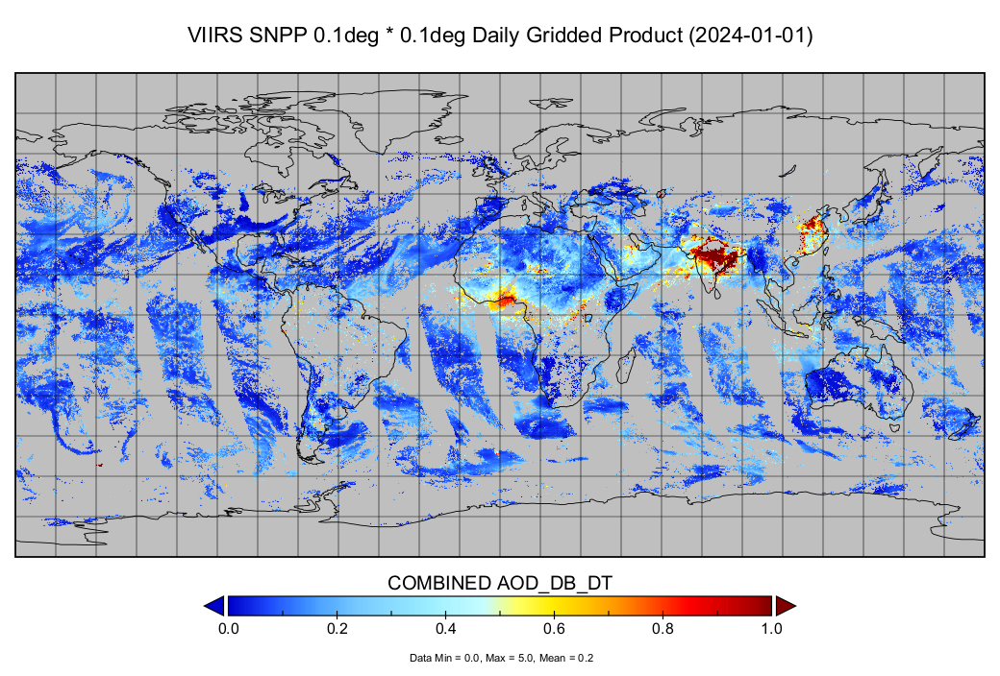

# viirs_snpp_daily_gridding



## Overview

`viirs_snpp_daily_gridding` can be used for processing and gridding daily VIIRS SNPP satellite data. It automates the workflow from raw data ingestion to spatially gridded outputs, supporting atmospheric and environmental research.

## Features

- Batch processing of VIIRS SNPP Level 2 data
- Flexible spatial gridding (user-defined resolution and extent)
- Output in NetCDF format

## Installation

Clone the repository and install dependencies (recommended: use a virtual environment):

### Using venv (standard Python virtual environment)

```bash
python -m venv venv
# On Windows:
venv\Scripts\activate
# On macOS/Linux:
# source venv/bin/activate
pip install .
```

### Using conda

```bash
conda create -n viirs_env python=3.9
conda activate viirs_env
pip install .
```

## Configuration

Edit `config.yaml` to customize gridding parameters, input/output paths, and quality filters.

## Usage

1. Edit `config.yaml` to set your parameters (gridding, input/output paths, etc).
2. Run the main script:

```bash
python main.py
```

This will process and grid the VIIRS SNPP data as specified in your configuration.